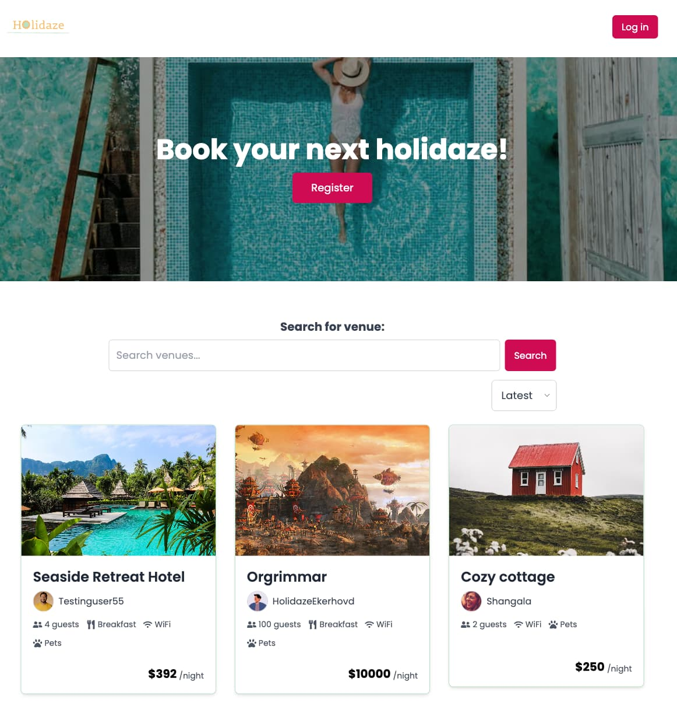
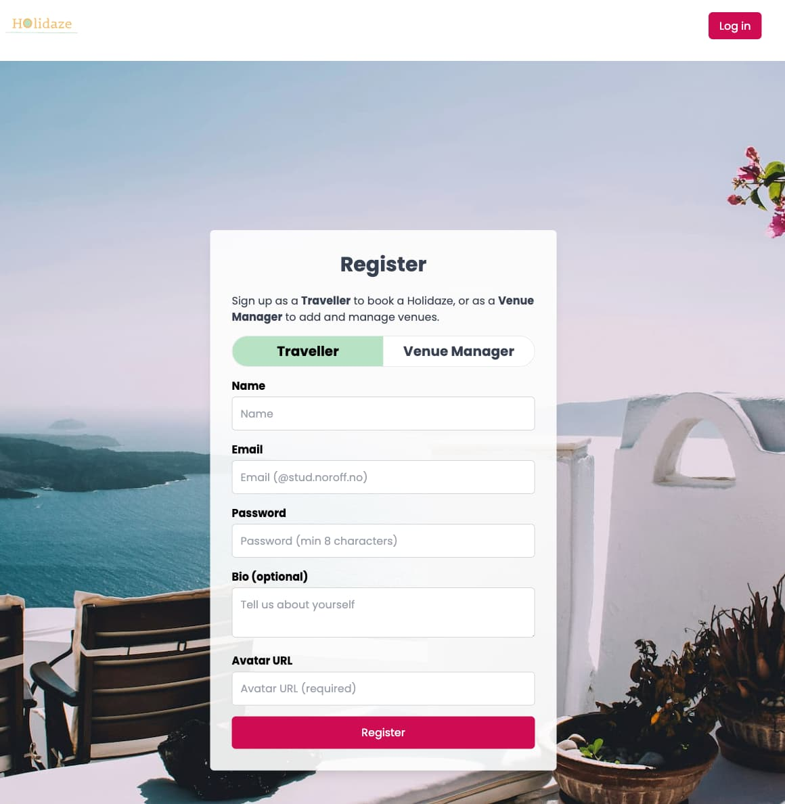
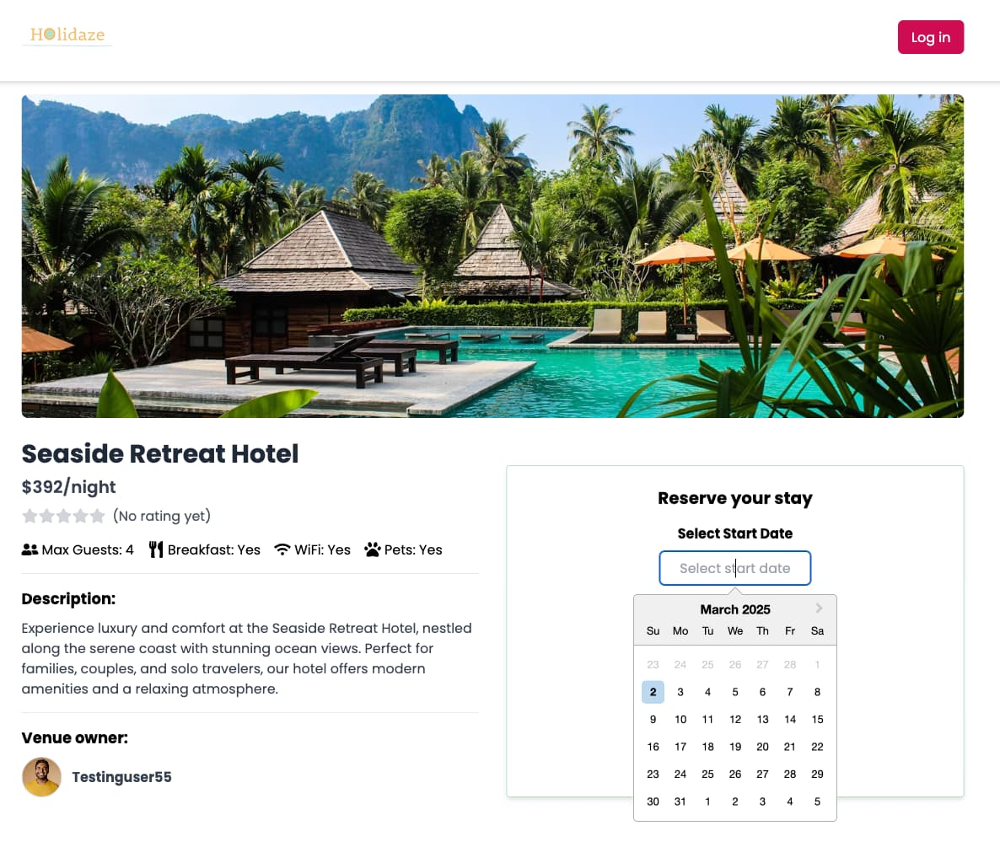
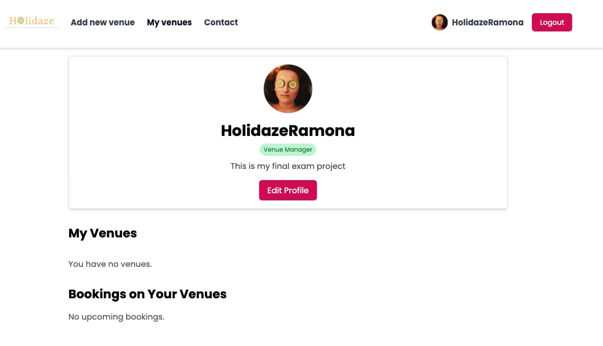

# Holidaze

[](https://reactjs.org/)  
[](https://reactrouter.com/)  
[](https://tailwindcss.com/)  
[](https://vitejs.dev/)  
[](https://tanstack.com/query/latest)  
[](https://github.com/pmndrs/zustand)  
[](https://react-hook-form.com/)  
[](https://github.com/jquense/yup)  
[](https://prettier.io/)  
[](https://eslint.org/)  
[](https://headlessui.dev/)


Holidaze is an eco-friendly venue booking platform that connects travellers with amazing venues and helps venue managers list and manage their properties. Built with modern React libraries and tools, Holidaze provides a smooth user experience with robust form validation, state management, and fast performance.

## Table of Contents

- [Features](#features)
- [Screenshots](#screenshots)
- [User Stories](#user-stories)
- [Technical Restrictions](#technical-restrictions)
- [Tech Stack](#tech-stack)
- [Installation](#installation)

## Features

- **Venue Discovery:** Browse and search for amazing venues.
- **Venue Details:** View detailed information including images, rating, amenities, owner info, and descriptions.
- **Booking System:** Registered travellers can create and manage bookings.
- **Venue Management:** Venue managers can add, edit, and delete their venues, as well as view bookings on their properties.
- **User Authentication:** Login and registration with validation (using React Hook Form and Yup) for travellers and venue managers.
- **Responsive Design:** Optimized for all devices with Tailwind CSS.
- **SEO-Friendly:** Dynamic meta tags and titles managed with React Helmet Async.
- **Infinite Scrolling:** Seamless data loading for venue listings.

## Screenshots






## User Stories

- A user may view a list of Venues
- A user may search for a specific Venue
- A user may view a specific Venue page by id
- A user may view a calendar with available dates for a Venue
- A user with a stud.noroff.no email may register as a customer
- A registered customer may create a booking at a Venue
- A registered customer may view their upcoming bookings
- A user with a stud.noroff.no email may register as a Venue manager
- A registered Venue manager may create a Venue
- A registered Venue manager may update a Venue they manage
- A registered Venue manager may delete a Venue they manage
- A registered Venue manager may view bookings for a Venue they manage
- A registered user may login
- A registered user may update their avatar
- A registered user may logout

## Technical Restrictions

- Must use an approved JavaScript framework.
- Must use an approved CSS framework.
- Must be hosted on an approved static host.
- Must use approved design and planning applications.

## Tech Stack

- **React** – UI library for building the user interface.
- **React Router** – For client-side routing.
- **Tailwind CSS** – Utility-first CSS framework for styling.
- **Vite** – Next Generation frontend tooling for fast development.
- **React Query (TanStack Query)** – Data fetching, caching, and synchronization.
- **React Hook Form** – Form management with minimal re-renders.
- **Yup** – Schema validation.
- **Zustand** – Small, fast, scalable state-management solution.
- **React Helmet Async** – Managing meta tags for SEO.
- **React Icons** – Icon library.
- **React Datepicker** – Date picking component.
- **React Toastify** – Notifications.
- **ESLint, Prettier, Husky, Lint-Staged** – Code quality and formatting tools.

## Installation

1. Clone the repository:

```bash
git clone git@github.com:RamonaXR/projectExam-2.git
```

2.  Install the dependencies:

```bash
npm install
```

### Setting Up Environment Variables

This project requires an environment variable to run the application. Create a `.env` file in the root directory of the project and add the following variable:

```
VITE_API_KEY=
```

**To obtain and configure an API key:**

1. Visit the [Noroff API documentation](https://docs.noroff.dev/docs/v2/auth/api-key) to generate an API key.
2. Use the generated API key as the value for `VITE_API_KEY` in the `.env` file.

### Running

To run the app in development mode, use the following command:

```bash
npm run dev
```

To build the app for production, use the following command:

```bash
npm run build
```
